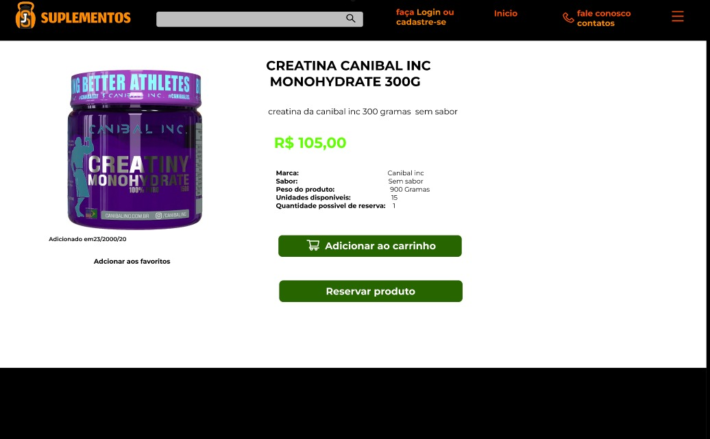
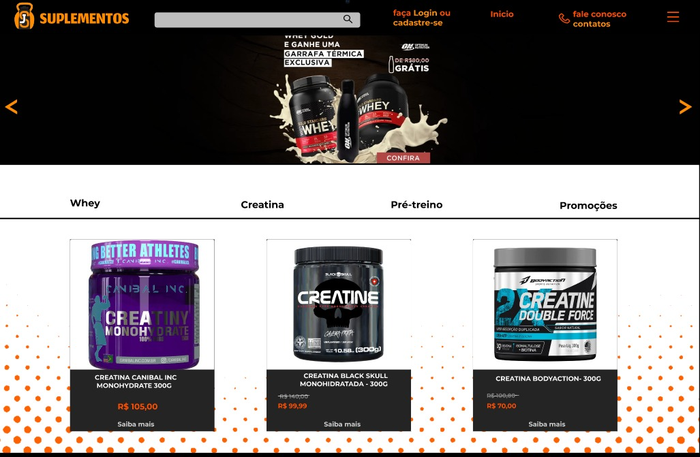

<h1>JS SUPLEMENTOS</h1>
O projeto JSSuplementos é uma aplicação voltada para a exibição e venda de produtos. O sistema está atualmente na fase de desenvolvimento de código, após a conclusão bem-sucedida da engenharia de requisitos e da construção do design. O objetivo principal do site é oferecer uma experiência de usuário intuitiva e eficiente, garantindo uma navegação simples e agradável. A plataforma será otimizada para facilitar o processo de compra, proporcionando aos usuários todos os recursos e benefícios necessários para adquirir os produtos de forma segura e conveniente.

<b>Essas são algumas das interfaces que estão em desenvolvimento</b>

  
  
  
  

