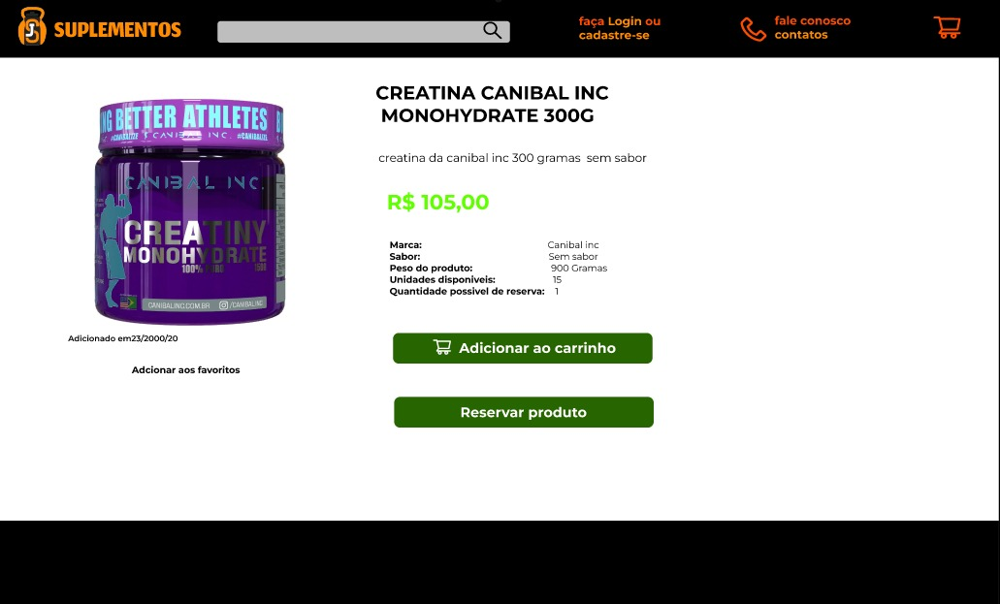

<h1>JS SUPLEMENTOS</h1>

O projeto <b>JSSuplementos</b> é uma aplicação voltada para a exibição e venda de produtos. O sistema está atualmente na fase de desenvolvimento de código, após a conclusão bem-sucedida da engenharia de requisitos e da construção do design. O objetivo principal do site é oferecer uma experiência de usuário intuitiva e eficiente, garantindo uma navegação simples e agradável. A plataforma será otimizada para facilitar o processo de compra, proporcionando aos usuários todos os recursos e benefícios necessários para adquirir os produtos de forma segura e conveniente.

<h2>Exibição do projeto</h2>

  
  
  
  

<nav>
  <h2>Tecnologias usadas</h2>
<ul>
  <b>
    <li>Next.js</li>
    <li>TypeScript</li>
    <li>Sequelize</li>
    <li>Axios</li>
    <li>Splide</li>
  </b>
</ul>
</nav>

